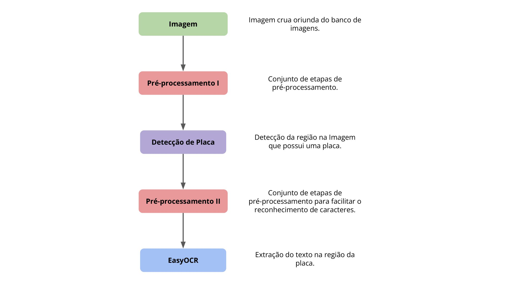
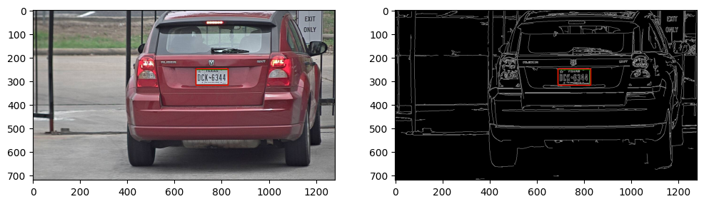
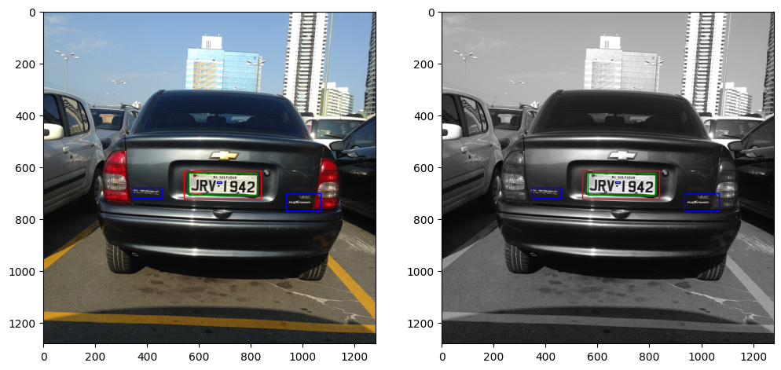
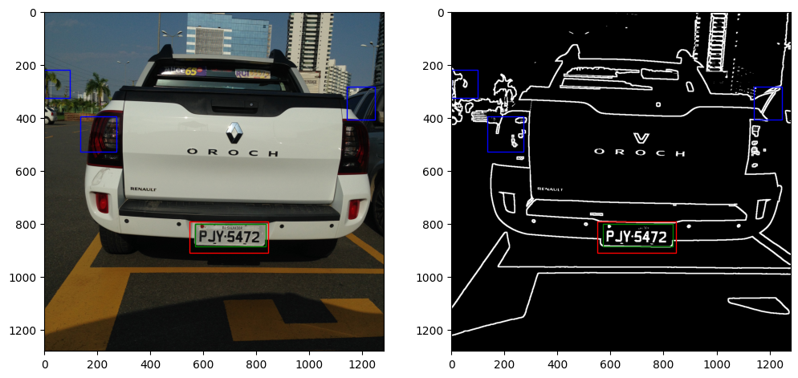

<h1 align="center">
  Simple ANPR
</h1>

<h4 align="center">Esse repositório contém um projeto de reconhecimento automático de placas veiculares, desenvolvido na disciplina Processamento de Imagens do curso de Ciência da Computação da UFRPE (2022.2).</h4>

<p align="center">
  <a href="#abordagens">Abordagens</a> •
  <a href="#como-utilizar">Como Utilizar</a>
</p>



## Abordagens



* Abordagem baseada em Bordas
  * **Filtro passa-baixa**: Bilateral, Média, Mediana, Gaussiano.
  * **Filtro passa-alta**: Canny, Laplaciano, Sobel, Prewitt e DoG.
  * Estratégia para seleção e detecção de placa.



* Abordagem baseada em Textura
  * **Transformada de Wavelet**
  * Estratégia para seleção e detecção de placa.



* Abordagem Baseada em Classificadores
  * **Redução de Ruídos**: Non-Local Means + Filtro passa-baixa.
  * **Dupla Binarização**: Otsu + Adaptative Mean.
  * Estratégia para seleção de regiões de interesse.
  * **Classificadores Probabilísticos para seleção da placa**: Regressor Logístico, Processo Gaussiano, Árvores de Decisão.

## Como Utilizar

Primeiro, devemos instalar as dependências e preparar o ambiente para execução dos códigos.

```bash
# Clonar o repositório
$ git clone https://github.com/SimpleANPR/anpr.git

# Acessar o repositório
$ cd anpr

# Configurar as dependências
$ python -m venv .venv
$ source .venv/bin/activate
$ pip install -e .
```

Depois, podemos acessar os Jupyter Notebooks:

- [Entrega Final](Entrega_Final.ipynb): contém a versão final das abordagens desenvolvidas.
- [2ª Entrega](2a_Entrega_ANPR.ipynb): contém uma entrega parcial com os filtros e processamentos implementados até aquele momento.


## Equipe

- **Mario Leandro Batista da Silva** [](https://github.com/MarioLeandro)
  - _Construiu a abordagem de detecção de placas veiculares baseada em Bordas._
- **João Pedro Freire de Andrade** [](https://github.com/mrjohnnus)
  - _onstruiu a abordagem de detecção de placas veiculares baseada em Textura._
- **Moésio Wenceslau da Silva Filho** [](https://github.com/moesio-f)
  - _Construiu a abordagem de detecção de placas veiculares baseada em Classificadores._